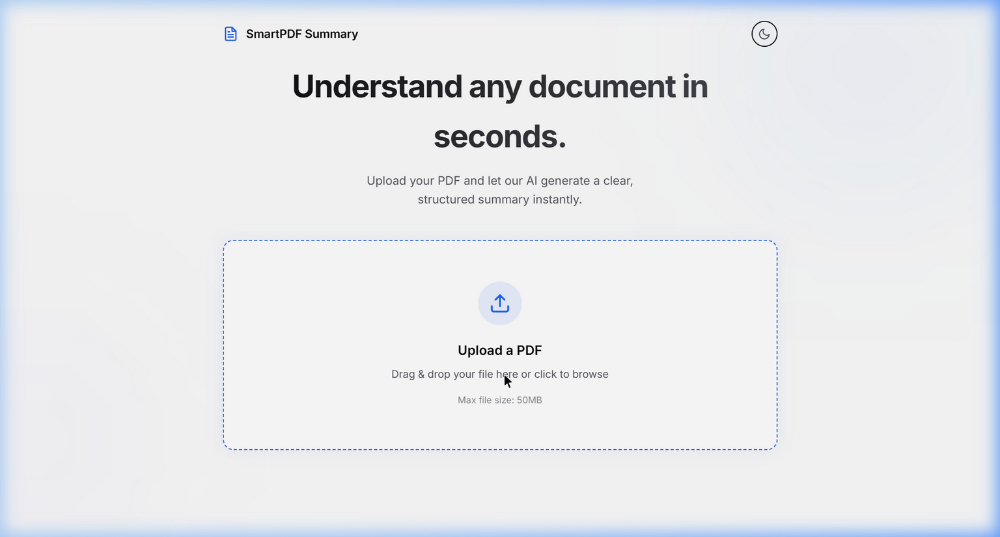

# SmartPDF Summary 🧠📄
An elegant, completely offline, and fully automated AI PDF Summarizer. 

Built with Node.js, Express, and modern glassmorphism frontend patterns, **SmartPDF Summary** allows you to upload large academic/professional PDF documents and transform them into beautifully structured study cards instantly. 

Powered entirely by local LLMs via **Ollama**, ensuring complete privacy and zero API costs.



## ✨ Features
- **Modern Minimalist UI**: Sleek dark-mode default, card-based layout, and smooth animations.
- **100% Offline & Private**: Uses local Llama 3 models via Ollama. No data is sent to the cloud.
- **Memory-Safe Extraction**: Parses PDFs cleanly using `pdf-parse` without saving unneeded files to your disk.
- **Smart Chunking**: Automatically breaks large documents down into contextually aware chunks so that the LLM limit is never overwhelmed.
- **Semantic Academic Structure**: Tightly prompt-engineered to always output JSON containing:
  - Global Overview
  - Key Concepts (Terms & Definitions)
  - Important Bullet Points
  - Detailed Synthesis
  - Final Conclusion
- **Quick Exports**: Instantly copy to clipboard, save as `.txt`, or generate formatted PDFs from your summaries directly via `jsPDF`.
- **Dynamic Word Counts**: Instantly compare original document length vs the condensed summary length.

---

## 🚀 Quickstart

### Prerequisites:
1. Ensure [Node.js](https://nodejs.org/) (v16+) is installed.
2. Install [Ollama](https://ollama.com/) natively.
3. Pull your required model:
```bash
ollama run llama3
```

### Setup:
1. Clone the repository:
```bash
git clone https://github.com/yourusername/smartpdf-summary.git
cd smartpdf-summary
```

2. Install dependencies:
```bash
npm install
```

3. Configure Environment (*Optional*):
Create a `.env` file in the root directory if you want to use a different local model or URL.
```env
OLLAMA_URL=http://localhost:11434/api/generate
OLLAMA_MODEL=llama3
PORT=3000
```

4. Start the Application:
```bash
npm start
```
*Your frontend will be served securely on `http://localhost:3000`*.

---

## 🛠️ Tech Stack
- **Frontend**: Vanilla HTML5, Advanced CSS3 (Vars, Glassmorphism, Responsive), Vanilla JS (`app.js`).
- **Backend API**: Node.js, Express.js.
- **Dependencies**: 
    - `pdf-parse` (v1.1.1) for reliable, clean text extraction.
    - `multer` for memory buffering file uploads.
    - `axios` for connecting the server logically to Ollama endpoints.
- **LLM Pipeline**: Ollama (`llama3`).

---

## 🛡️ License
Licensed under the [MIT License](LICENSE).

Feel free to fork, expand the prompts, create PRs, or modify the themes to match your specific productivity workspace.
